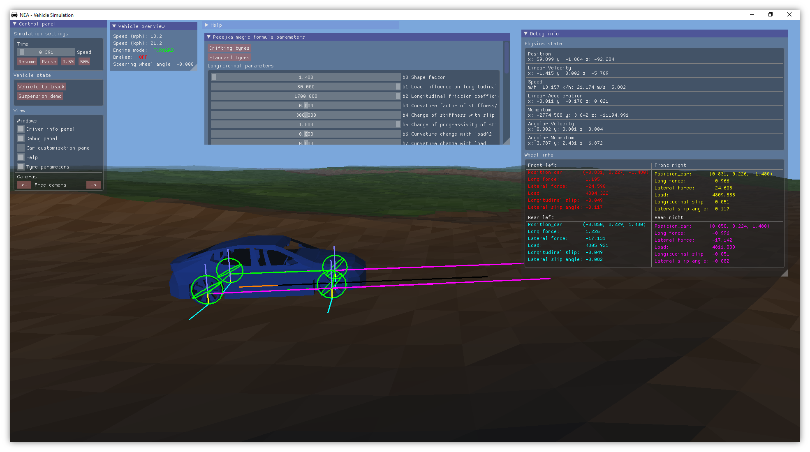

# A-Level-Computer-Science-NEA
Non-exam assessment project for AQA A level computer science, developed between September 2017 and April 2018.

### Aims
1. The main focus was getting the maximum number of marks possible for the A level.
2. After this, the project was used to test and make improvements to an application framework library being developed. 

### The Non-Exam Assessment
This project counts for 20% of the final A level result. Details on the requirements for the NEA can be found [here](http://filestore.aqa.org.uk/resources/computing/AQA-7517-NEA-GUIDE.PDF).

### License
[MIT License](https://github.com/lbowes/A-Level-Computer-Science-NEA/blob/master/LICENSE)

---

